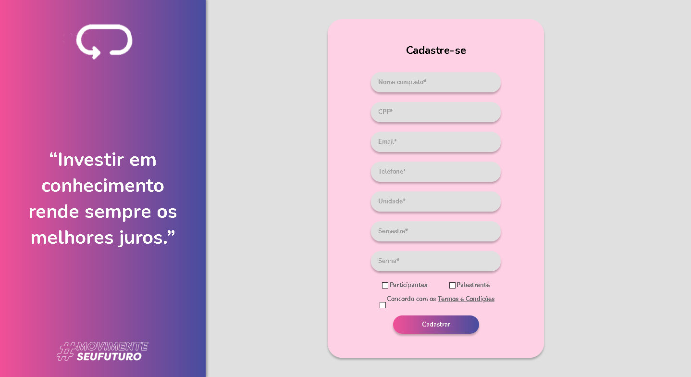

<h1 align="center">
  
</h1>

<h3 align="center">
Web application for event management.
</h3>


# Índice

- [Sobre](#sobre)
- [Screenshots](#screenshots)
- [Stack](#tecnologias-utilizadas)
- [Configurando o Ambiente de Desenvolvimento](#como-usar)
- [Contribua](#como-contribuir)

<a id="sobre"></a>

## :bookmark:  Sobre

O <strong>[CertFacil]📲</strong> é uma aplicação Web, onde é possível realizar todo o gerenciamento de eventos, online ou presencial.

</details>

<a id="screenshots"></a>

## :heart_eyes: Screenshots
<details>
  <summary>
    Visualizar layout
  </summary>
  
  
  
</details>

<a id="tecnologias-utilizadas"></a>

## :rocket: Stack

Esta aplicação foi desenolvida com as seguintes tecnologias:

- [Angular](https://angular.io/)
- [TypeScript](https://www.typescriptlang.org/)

<a id="como-usar"></a>

## :fire:  Configurando o Ambiente de Desenvolvimento

- ### **Pré-requisitos**

  - É **necessário** possuir o **[Node.js](https://TheOnlyRealDevLanguage.org/en/)** instalado na máquina
  - Também, é **preciso** ter um gerenciador de pacotes, se você já tem o Node.js, então o **[NPM](https://www.npmjs.com/)** já vai estar disponível.

1. Faça um clone :

```sh
  $ git clone https://github.com/beatrizalvesfel/moveit-reactJS.git
```

2. iNstalando o Angular:

```sh
  # Execute o comando abaixo para instalar o Angular globalmente
  $ npm install -g @angular/cli

```

3. Executando a Aplicação:

```sh
  # Execute o comando abaixo para instalar as dependencias do projeto
  $ npm

  # Inciciar o servidor de desenvolvimento
  $ ng serve

```

<a id="como-contribuir"></a>

## :heavy_check_mark: Como Contribuir

- Faça um Fork desse repositório

- Clone o repositório
```sh
  $ git clone https://github.com/<SEU_USUARIO_GIT>/little-friend.git
```
- Crie um branch com sua feature: `git checkout -b nome-da-feature`

- Comite suas mudanças: `git commit -m 'feat: Breve descrição da feature'`

- Envie a feature: `git push origin nome-da-feature`

## :computer: Author

<table>
  <tr>
    <td align="center">
      <a href="https://www.linkedin.com/in/beatrizalvesfel/">
        
        <br />
        <sub>
          <b>@Beatriz Alves</b>
        </sub>
       </a>
    </td>
    <td align="center">
      <a href="https://www.linkedin.com/in/jeffson-vitor-dos-santos-cavalcante-24aa91192/">
        
        <br />
        <sub>
          <b>@Jeffson Vitor</b>
        </sub>
       </a>
    </td>
        <td align="center">
      <a href="https://www.linkedin.com/in/natalia-cardoso-64ba661b9/">
        
        <br />
        <sub>
          <b>@Natalia Cardoso</b>
        </sub>
       </a>
    </td>
        <td align="center">
      <a href="https://www.linkedin.com/in/">
        
        <br />
        <sub>
          <b>@Rodrigo da Hora</b>
        </sub>
       </a>
    </td>
  </tr>
</table>

## :memo:  License

Esse projeto está sob a licença MIT. Acesse o arquivo [LICENSE](LICENSE) para mais detalhes.
